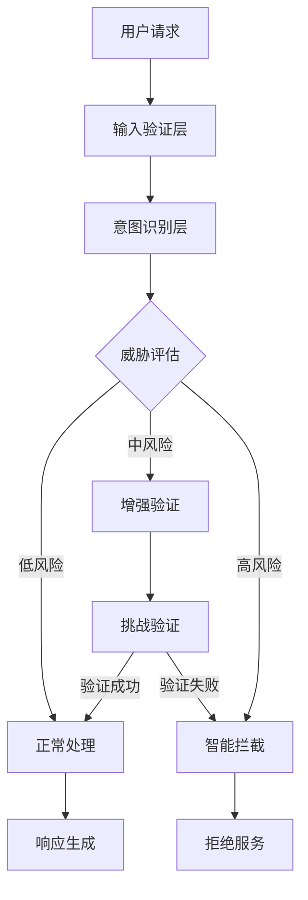

<!--
 * @Author: Z2-WIN\xmm wujixmm@gmail.com
 * @Date: 2025-12-26 15:30:00
 * @LastEditors: Z2-WIN\xmm wujixmm@gmail.com
 * @LastEditTime: 2025-12-26 15:30:00
 * @FilePath: docs/core/user-registration.md
 * @Description: 用户注册流程 - 智能防御系统技术文档
-->

# 用户注册流程 - 智能防御系统

本文档详细介绍了 Flutter Ex1 后端的用户注册流程，重点介绍了基于意图识别的智能防御系统设计。

## 🛡️ 防御架构概览

### 核心设计理念

采用**分层响应机制**和**攻击成本破产分析模型**，构建完整的攻防对抗架构。



### 防御层次

1. **输入验证层**: 基础数据验证和格式检查
2. **意图识别层**: 基于机器学习的用户行为分析
3. **威胁评估层**: 动态风险评分算法
4. **响应机制层**: 分级响应策略

## 🔍 意图识别系统

### 行为特征分析

系统通过多维度特征分析识别恶意意图：

#### 请求模式特征

```typescript
interface RequestFeatures {
  // 请求频率特征
  requestRate: number; // 请求频率（次/分钟）
  requestBurst: boolean; // 突发请求标识
  requestInterval: number; // 请求间隔时间

  // 用户代理特征
  userAgent: string; // 用户代理字符串
  userAgentConsistency: boolean; // UA 一致性
  suspiciousHeaders: string[]; // 可疑头部

  // IP 地址特征
  ipAddress: string;
  geoLocation: GeoData; // 地理位置信息
  ipReputation: ReputationScore; // IP 信誉评分
}
```

#### 注册行为特征

```typescript
interface RegistrationFeatures {
  // 账号信息特征
  emailPattern: EmailPattern; // 邮箱模式分析
  usernamePattern: UsernamePattern; // 用户名模式分析

  // 时间特征
  registrationTime: Date;
  timeOfDay: TimeDistribution; // 注册时间段分布

  // 设备特征
  deviceFingerprint: string; // 设备指纹
  sessionDuration: number; // 会话持续时间
}
```

### 机器学习模型

#### 特征权重算法

```typescript
class IntentAnalyzer {
  private readonly weights = {
    requestRate: 0.25, // 请求频率权重
    ipReputation: 0.2, // IP 信誉权重
    emailPattern: 0.15, // 邮箱模式权重
    userAgentConsistency: 0.1, // UA 一致性权重
    deviceFingerprint: 0.1, // 设备指纹权重
    timePattern: 0.1, // 时间模式权重
    otherFeatures: 0.1, // 其他特征权重
  };

  calculateRiskScore(features: RequestFeatures): RiskScore {
    let score = 0;

    // 计算各特征风险分数
    score += this.calculateRequestRateRisk(features.requestRate);
    score += this.calculateIPReputationRisk(features.ipReputation);
    score += this.calculateEmailPatternRisk(features.emailPattern);

    return this.normalizeScore(score);
  }
}
```

## ⚖️ 分层响应机制

### 风险等级定义

```typescript
enum RiskLevel {
  LOW = 'low', // 0-30 分
  MEDIUM = 'medium', // 31-60 分
  HIGH = 'high', // 61-85 分
  CRITICAL = 'critical', // 86-100 分
}

interface RiskAssessment {
  level: RiskLevel;
  score: number;
  reasons: string[];
  recommendedActions: ActionType[];
}
```

### 响应策略

#### 低风险 (LOW)

```typescript
const lowRiskResponse = {
  action: 'allow',
  additionalChecks: [],
  logLevel: 'info',
  responseDelay: 0,
};
```

#### 中风险 (MEDIUM)

```typescript
const mediumRiskResponse = {
  action: 'challenge',
  challenges: [
    ChallengeType.EMAIL_VERIFICATION,
    ChallengeType.CAPTCHA,
    ChallengeType.SMS_VERIFICATION,
  ],
  logLevel: 'warning',
  responseDelay: 1000, // 1秒延迟
};
```

#### 高风险 (HIGH)

```typescript
const highRiskResponse = {
  action: 'enhanced_verification',
  challenges: [
    ChallengeType.IDENTITY_VERIFICATION,
    ChallengeType.MANUAL_REVIEW,
    ChallengeType.WAITING_PERIOD,
  ],
  logLevel: 'error',
  responseDelay: 5000, // 5秒延迟
};
```

#### 严重风险 (CRITICAL)

```typescript
const criticalRiskResponse = {
  action: 'block',
  blockDuration: '24h', // 24小时封禁
  escalationRequired: true,
  logLevel: 'critical',
  responseDelay: 10000, // 10秒延迟
};
```

## 💰 攻击成本破产分析

### 成本计算模型

```typescript
class AttackCostAnalyzer {
  calculateAttackCost(attackProfile: AttackProfile): AttackCost {
    const costs = {
      // 时间成本
      timeCost: this.calculateTimeCost(attackProfile),

      // 经济成本
      monetaryCost: this.calculateMonetaryCost(attackProfile),

      // 技术成本
      technicalCost: this.calculateTechnicalCost(attackProfile),

      // 机会成本
      opportunityCost: this.calculateOpportunityCost(attackProfile),
    };

    return {
      totalCost: Object.values(costs).reduce((sum, cost) => sum + cost, 0),
      costBreakdown: costs,
      profitabilityThreshold:
        this.calculateProfitabilityThreshold(attackProfile),
    };
  }
}
```

### 成本提升策略

#### 1. 时间成本提升

```typescript
const timeCostStrategies = {
  // 渐进式延迟
  progressiveDelay: {
    baseDelay: 1000, // 基础延迟 1秒
    incrementPerAttempt: 500, // 每次尝试增加 0.5秒
    maxDelay: 30000, // 最大延迟 30秒
  },

  // 冷却期机制
  cooldownPeriod: {
    firstOffense: '5m', // 首次违规 5分钟冷却
    repeatOffense: '30m', // 重复违规 30分钟冷却
    serialOffense: '24h', // 连续违规 24小时冷却
  },
};
```

#### 2. 经济成本提升

```typescript
const economicCostStrategies = {
  // 资源消耗
  resourceConsumption: {
    cpuIntensive: true, // CPU 密集型验证
    memoryIntensive: true, // 内存密集型验证
    bandwidthThrottling: true, // 带宽限制
  },

  // 服务成本
  serviceCost: {
    smsCost: 0.05, // 每次短信验证成本
    emailCost: 0.01, // 每次邮件验证成本
    captchaCost: 0.02, // 每次验证码成本
  },
};
```

#### 3. 技术成本提升

```typescript
const technicalCostStrategies = {
  // 高级验证
  advancedVerification: {
    deviceFingerprinting: true, // 设备指纹识别
    behaviorAnalysis: true, // 行为分析
    networkAnalysis: true, // 网络分析
  },

  // 动态挑战
  dynamicChallenges: {
    adaptiveCaptcha: true, // 自适应验证码
    proofOfWork: true, // 工作量证明
    biometricVerification: false, // 生物识别验证（可选）
  },
};
```

## 🏗️ 完整架构实现

### 核心组件

```typescript
// 防御系统主控制器
class DefenseSystem {
  private intentAnalyzer: IntentAnalyzer;
  private costAnalyzer: AttackCostAnalyzer;
  private responseEngine: ResponseEngine;
  private auditLogger: AuditLogger;

  async processRegistrationRequest(
    request: RegistrationRequest
  ): Promise<RegistrationResponse> {
    // 1. 特征提取
    const features = await this.extractFeatures(request);

    // 2. 意图分析
    const intent = await this.intentAnalyzer.analyze(features);

    // 3. 成本分析
    const costAnalysis = await this.costAnalyzer.analyze(intent);

    // 4. 风险评估
    const riskAssessment = this.assessRisk(intent, costAnalysis);

    // 5. 生成响应
    const response = await this.responseEngine.generateResponse(
      riskAssessment,
      request
    );

    // 6. 审计日志
    await this.auditLogger.log({
      requestId: request.id,
      riskLevel: riskAssessment.level,
      response: response,
      timestamp: new Date(),
    });

    return response;
  }
}
```

### 数据库设计

```prisma
// 注册防御记录表
model RegistrationDefense {
  id              String   @id @default(cuid())
  requestId       String   @unique
  userId          String?  // 如果注册成功
  ipAddress       String
  userAgent       String
  riskScore       Float
  riskLevel       RiskLevel
  intentAnalysis  Json     // 意图分析结果
  costAnalysis    Json     // 成本分析结果
  response        Json     // 响应详情
  createdAt       DateTime @default(now())
  updatedAt       DateTime @updatedAt

  @@index([ipAddress])
  @@index([riskLevel])
  @@index([createdAt])
}

// 攻击模式表
model AttackPattern {
  id              String   @id @default(cuid())
  patternName     String
  signature       String   // 攻击特征签名
  riskWeight      Float    // 风险权重
  mitigationRules Json     // 缓解规则
  createdAt       DateTime @default(now())

  @@unique([signature])
}
```

## 📊 监控和分析

### 实时监控指标

```typescript
interface DefenseMetrics {
  // 请求统计
  totalRequests: number;
  blockedRequests: number;
  challengeRate: number;

  // 风险分布
  riskDistribution: Record<RiskLevel, number>;

  // 成本效益
  attackCostIncrease: number;
  falsePositiveRate: number;

  // 性能指标
  averageProcessingTime: number;
  throughputPerSecond: number;
}
```

### 告警系统

```typescript
class DefenseAlertSystem {
  async checkAlerts(metrics: DefenseMetrics): Promise<Alert[]> {
    const alerts: Alert[] = [];

    // 高风险请求激增告警
    if (metrics.riskDistribution[RiskLevel.HIGH] > 0.1) {
      alerts.push({
        type: 'HIGH_RISK_SURGE',
        severity: 'critical',
        message: 'High-risk requests exceeded 10% threshold',
      });
    }

    // 误报率过高告警
    if (metrics.falsePositiveRate > 0.05) {
      alerts.push({
        type: 'HIGH_FALSE_POSITIVE',
        severity: 'warning',
        message: 'False positive rate exceeded 5%',
      });
    }

    return alerts;
  }
}
```

## 🚀 部署和配置

### 环境配置

```typescript
// 生产环境配置
const productionConfig = {
  defense: {
    enabled: true,
    strictMode: false,

    // 风险阈值
    riskThresholds: {
      low: 30,
      medium: 60,
      high: 85,
    },

    // 响应配置
    responses: {
      challengeDelay: 1000,
      blockDelay: 5000,
      criticalDelay: 10000,
    },

    // 成本配置
    costAnalysis: {
      enabled: true,
      minAttackCost: 100, // 最小攻击成本阈值
      costMultiplier: 2, // 成本倍数
    },
  },
};
```

### 性能优化

1. **缓存策略**: 意图分析结果缓存
2. **异步处理**: 非关键验证异步执行
3. **批处理**: 批量风险评估
4. **CDN 加速**: 静态验证资源 CDN 分发

---

> 💡 **提示**: 本系统设计遵循安全第一、性能第二的原则。在实际部署时需要根据业务特点调整参数和策略。
